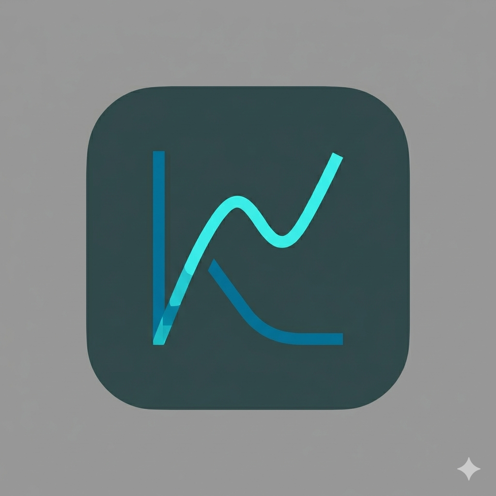

<div align="center">
  
  
  <h1 align="center" style="border:0;">ktop 🔥</h1>
  
  <p align="center">A minimalist, cross-platform system monitor for your terminal.</p>

  <p align="center">
   
    <a href="https://github.com/MahiroJV/ktop/stargazers">
      
    </a> 
    
    
    
    
  </p>

  <br>

</div>

# Overview

**koktail's system monitor** — a btop-inspired TUI written in Rust.

```
 ktop — koktail's system monitor                        14:23:01 UTC
┌─ CPU  12th Gen Intel Core i7 ──────────────┐┌─ Memory ────────────────────┐
│ Total  33%  [████░░░░░░░░░░░░░░░░░░░░░░]   ││ RAM   67%  [█████████░░░░] │
│ Core0  41%  [██████░░░░░░░░░░░░░░░░░░░░]   ││   Used: 10842 MB / 15987 MB│
│ Core1  28%  [████░░░░░░░░░░░░░░░░░░░░░░]   ││ Swap   0%   [░░░░░░░░░░░░] │
│ Core2  19%  [███░░░░░░░░░░░░░░░░░░░░░░░]   ││   Used: 0 MB / 8192 MB     │
│ Freq: 2400 MHz                              │└─────────────────────────────┘
└─────────────────────────────────────────────┘┌─ Network  [wlan0] ──────────┐
┌─ Disk  [/dev/sda] ─────────────────────────┐│ ↓ 142 KB/s   ↑ 12 KB/s    │
│ /     54%  [████████░░░░░░░░░░░░░░░░░░░]   ││ Total ↓ 2048 MB  ↑ 312 MB  │
│   Used: 256.4 GB / 476.9 GB                │└─────────────────────────────┘
└─────────────────────────────────────────────┘
┌─ Processes ─────────────────────────────────────────────────────────────────┐
│ PID     Name                   CPU%    MEM MB                               │
│ 3241    rustrover              72.9%   1024                                 │
│ 1892    firefox                14.2%   512                                  │
│ 4102    ktop                    2.1%   8                                    │
└─────────────────────────────────────────────────────────────────────────────┘
 q:quit
```

## Features

- **CPU** — overall usage, per-core bars, frequency
- **Memory** — RAM and swap with colored gauges
- **Disk** — usage % and GB used/total
- **Network** — live ↓↑ KB/s and total transferred
- **Processes** — top 10 by CPU, color-coded by load
- Gauges go green → yellow → red based on usage level
- Graceful handling of small terminals

## Requirements

- Rust (stable) — install from [rustup.rs](https://rustup.rs)
- Linux (reads from `/proc` and `/sys` via sysinfo)

## Install

```bash
git clone https://github.com/MahiroJV/ktop.git
cd ktop
chmod +x install.sh
./install.sh
```

This builds a release binary and copies it to `~/.local/bin/ktop`.

Make sure `~/.local/bin` is in your PATH:

```bash
echo 'export PATH="$HOME/.local/bin:$PATH"' >> ~/.bashrc
source ~/.bashrc
```

Then just run:

```bash
ktop
```

## Manual build

```bash
cargo build --release
./target/release/ktop
```

## Uninstall

```bash
rm ~/.local/bin/ktop
```

## Keybinds

| Key | Action |
|-----|--------|
| `q` | Quit   |
| `c/C`| Sort by CPU usage |
| `m/M`| Sort by Memory usage |
| `p` | Sort by ID |
| `n` | Sort by Name |

## Dependencies

| Crate | Version | Purpose |
|-------|---------|---------|
| [sysinfo](https://crates.io/crates/sysinfo) | 0.29 | System data (CPU, RAM, disk, net, processes) |
| [tui](https://crates.io/crates/tui) | 0.19 | Terminal UI framework |
| [crossterm](https://crates.io/crates/crossterm) | 0.27 | Cross-platform terminal control |

## Project structure

```
ktop/
├── src/
│   ├── main.rs      # event loop + wiring
│   ├── system.rs    # all data collection
│   └── ui.rs        # all TUI rendering
├── Cargo.toml
├── install.sh
└── README.md
```

## License

MIT License © 2026 Mahir
