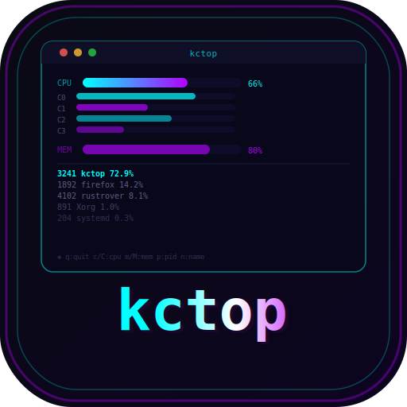
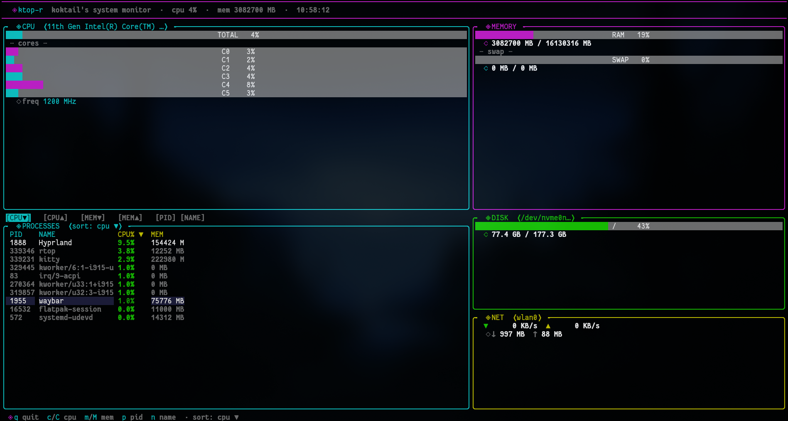

<div align="center">
  

  <h1 align="center" style="border:0;">kctop 🔥</h1>

  <p align="center">koktail claude's top — a futuristic TUI system monitor written in Rust.</p>
  <p align="center">
    
    <a href="https://github.com/MahiroJV/kctop/stargazers">
      
    </a>
    
    
     <a href="https://claude.ai">
      
    </a>
    <br>
    
    
    
    
   
  </p>
  <br>
</div>

# Overview

**kctop** is a btop-inspired terminal UI system monitor built with Rust. It features a futuristic neon dashboard layout with mouse support, live sorting, and a disk directory breakdown.

<p align="center">
  
</p>

## Features

- **CPU** — overall + per-core bars, frequency, core count
- **Memory** — RAM and swap with colored gauges
- **Disk** — usage %, GB used/total, and top directories breakdown
- **Network** — live ↓↑ KB/s and total session transfer
- **Processes** — top 10, sortable by CPU/MEM/PID/Name, color-coded by load
- **Mouse support** — click sort buttons, hover to highlight rows, scroll to navigate
- **Futuristic UI** — neon cyan/purple theme, gauges go green → yellow → red by load
- Graceful handling of small terminals (80×24 minimum)
- Launches from terminal or app launcher as a desktop app

## Requirements

- Rust (stable) — install from [rustup.rs](https://rustup.rs)
- Linux — reads from `/proc` and `/sys` via sysinfo

## Install

```bash
git clone https://github.com/MahiroJV/kctop.git
cd kctop
chmod +x install.sh
./install.sh
```

Installs the binary, app icon, and desktop entry so kctop appears in your app launcher.

Make sure `~/.local/bin` is in your PATH:

```bash
echo 'export PATH="$HOME/.local/bin:$PATH"' >> ~/.bashrc
source ~/.bashrc
```

Then run:

```bash
kctop
```

Or search **kctop** in your app launcher (GNOME, KDE, XFCE).

## Manual build

```bash
cargo build --release
./target/release/kctop
```

## Uninstall

```bash
chmod +x uninstall.sh
./uninstall.sh
```

Or manually:

```bash
rm ~/.local/bin/kctop
rm ~/.local/share/applications/kctop.desktop
rm ~/.local/share/icons/kctop.svg
```

## Keybinds

| Key | Action |
|-----|--------|
| `q` | Quit |
| `r` | Force refresh |
| `c` / `C` | Sort processes by CPU ▼ / ▲ |
| `m` / `M` | Sort processes by Memory ▼ / ▲ |
| `p` | Sort processes by PID |
| `n` | Sort processes by Name |

## Mouse

| Action | Effect |
|--------|--------|
| Click sort button | Change sort order instantly |
| Hover process row | Highlight row |
| Scroll wheel | Navigate process rows |

## Dependencies

| Crate | Version | Purpose |
|-------|---------|---------|
| [sysinfo](https://crates.io/crates/sysinfo) | 0.29 | CPU, RAM, disk, network, processes |
| [tui](https://crates.io/crates/tui) | 0.19 | Terminal UI framework |
| [crossterm](https://crates.io/crates/crossterm) | 0.27 | Terminal control + mouse events |

## Project structure

```
kctop/
├── src/
│   ├── main.rs       # event loop + wiring
│   ├── system.rs     # data collection + sorting + disk dirs
│   └── ui.rs         # TUI rendering + mouse handling
├── assets/
│   ├── kctop.svg     # app icon
│   └── Screenshot.png
├── Cargo.toml
├── install.sh        # builds + installs binary, icon, desktop entry
├── uninstall.sh      # clean removal
└── README.md
```

## License

MIT License © 2026 Mahir
